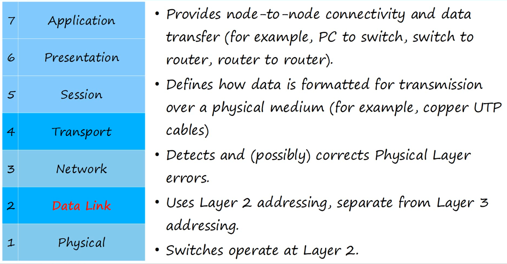
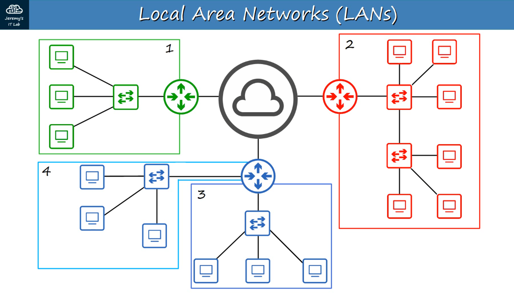

* Ngày 5. ETHERNET LAN SWITCHING : Phần 1

LAN's

- Một LAN là một mạng nằm trong một khu vực tương đối nhỏ.
- Router được dùng để kết nối các LAN riêng biệt.

Một ETHERNET FRAME trông như sau:

Ethernet Trailer --- PACKET --- Ethernet Header

Ethernet Header chứa 5 trường:

Preamble -- SFD -- Destination -- Source -- Type
7 bytes  -- 1 byte -- 6 bytes -- 6 bytes -- 2 bytes

---

PREAMBLE:

- Độ dài: 7 bytes (56 bit)
- Dãy 1 và 0 xen kẽ
- 10101010 * 7 lần
- Cho phép các thiết bị đồng bộ hóa xung nhịp của bộ thu.

SFD : ‘Start Frame Delimiter’

- Độ dài: 1 byte (8 bit)
- 10101011
- Đánh dấu kết thúc PREAMBLE và bắt đầu phần còn lại của frame.

---

DESTINATION AND SOURCE

- Địa chỉ Tầng 2
- Chỉ ra thiết bị gửi/nhận frame
- MAC = ’Media Access Control’ - Địa chỉ vật lý duy nhất gắn liền với mỗi card mạng = Địa chỉ 6 byte (48-bit) của thiết bị vật lý.

---

TYPE / LENGTH

- Trường 2 byte (16-bit)
- Giá trị ≤ 1500: chỉ chiều dài của gói tin bên trong (tính bằng byte).
- Giá trị ≥ 1536: chỉ loại gói tin bên trong, chiều dài được xác định bằng cách khác.
- IPv4 = 0x0800 (hexadecimal) = 2048 in decimal
- IPv6 = 0x86DD (hexadecimal) = 34525 in decimal
- Xác định giao thức Tầng 3 dùng trong gói tin đóng gói, hầu hết là IP v4 hoặc v6.

---

The ETHERNET TRAILER chứa:

FCS ‘FRAME CHECK SEQUENCE’
- Độ dài 4 bytes (32 bit)
- Phát hiện dữ liệu hỏng bằng cách chạy thuật toán CRC (Cyclic Redundancy Check) trên dữ liệu nhận được.

---

Tổng cộng một ETHERNET FRAME = 26 bytes (header + trailer).

---

MAC ADDRESS (48 bits long)

- Địa chỉ vật lý 6 byte (48 bit) được gán cho thiết bị khi sản xuất.
- Còn gọi là Burned-In Address (BIA).
- Duy nhất toàn cầu.
- 3 byte đầu là OUI (Organizationally Unique Identifier), cấp cho hãng sản xuất.
- 3 byte cuối là duy nhất cho từng thiết bị.
- Viết dưới dạng 12 ký tự thập lục phân.

Example:

E8:BA:70 // 11:28:74
OUI    // Unique Device ID

HEXADECIMAL

INTERFACE NAMES

F0/1, F0/2, F0/3... F F nghĩa là Fast Ethernet hay giao diện 100 Mbps.

---

MAC ADDRESS TABLE

Mỗi Switch lưu một Bảng Địa Chỉ MAC được học động, dựa trên SOURCE MAC ADDRESS của frame mà nó nhận.

Khi Switch không biết DESTINATION MAC ADDRESS của một frame (UNKNOWN UNICAST FRAME), nó buộc phải FLOOD frame đó – tức là chuyển tiếp frame ra tất cả các cổng, trừ cổng đã nhận gói tin.

Khi Switch biết địa chỉ đích (địa chỉ MAC đã có trong MAC ADDRESS TABLE), frame được chuyển tiếp bình thường.

- Ghi chú: Địa chỉ MAC động sẽ bị xóa khỏi bảng sau 5 phút không hoạt động.
