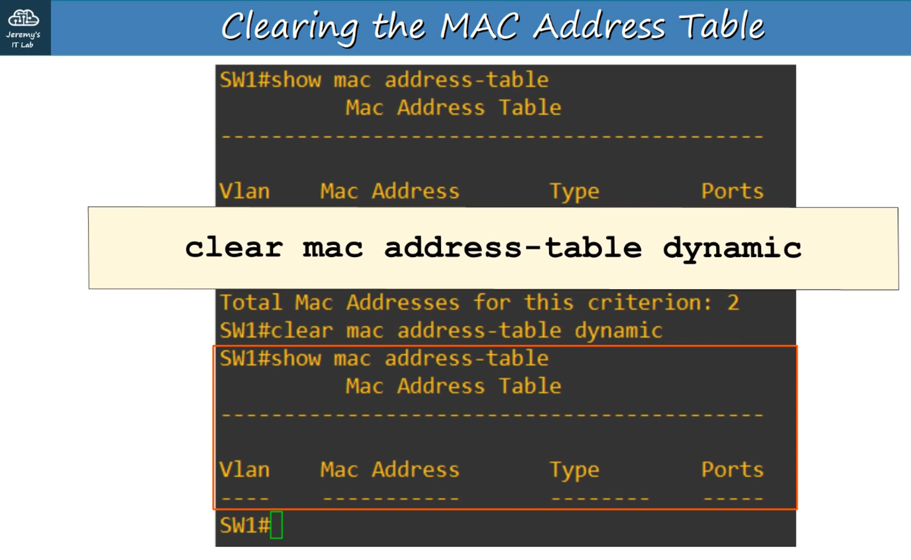

* Ngày 6. ETHERNET LAN SWITCHING : Phần 2

Một ETHERNET FRAME trông như sau:

Ethernet Header --- DATA (Packet) --- Ethernet Trailer

Ethernet Header chứa 5 trường:

Preamble -- SFD -- Destination -- Source -- Type/Length
7 bytes  -- 1 byte -- 6 bytes -- 6 bytes --   2 bytes

Ethernet Trailer chứa 1 trường:

FCS (Frame Check Sequence) = 4 bytes

- Preamble + SFD thường không được coi là một phần của ETHERNET HEADER.

Vì vậy kích thước của ETHERNET HEADER + TRAILER là 18 bytes

(6 + 6 + 2 + 4 bytes cho FRAME CHECK SEQUENCE)

---

Kích thước TỐI THIỂU cho một ETHERNET FRAME (Header + Payload [PACKET] + Trailer) là 64 BYTES.

64 BYTES - 18 BYTES (Header + Trailer size) = 46 BYTES

Vì vậy kích thước TỐI THIỂU của DATA PAYLOAD (PACKET) là 46 BYTES!

Nếu PAYLOAD nhỏ hơn 46 BYTES thì sẽ thêm các byte đệm (padding bytes) (các byte đệm là chuỗi số 0) cho đủ 46 BYTES.

---

Khi một PC gửi gói tin đến thiết bị có IP chưa biết, nó sử dụng ARP Request.

- ARP = 'Address Resolution Protocol'.
- Dùng để tìm địa chỉ Tầng 2 (MAC) của một địa chỉ Tầng 3 (IP) đã biết.
- Gồm hai thông điệp:
    - ARP REQUEST (Thông điệp từ nguồn)
    - ARP REPLY (Thông điệp trả lời từ đích)
- ARP REQUEST là BROADCAST = gửi đến tất cả host trong mạng, trừ host đã gửi yêu cầu.

Một ARP REQUEST frame có:

- Source IP Address
- Destination IP Address
- Source MAC address
- BROADCAST MAC Address - FFFF.FFFF.FFFF

An ARP REPLY frame có:

- Source IP Address
- Destination IP Address
- Source MAC address
- Destination MAC Address

ARP REPLY là UNICAST frame = chỉ gửi cho host đã gửi ARP REQUEST.

---

PING

- Công cụ mạng dùng để kiểm tra khả năng kết nối.
- Đo thời gian khứ hồi (round-trip time).
- Dùng hai thông điệp:
    - ICMP Echo REQUEST
    - ICMP Echo REPLY
- Là UNICAST
- Lệnh sử dụng ping:
    - ping <ip-address>

Mặc định, CISCO IOS gửi 5 yêu cầu/trả lời ICMP
(kích thước mặc định 100 bytes).

- Dấu chấm (.) = ping thất bại
- Dấu chấm than (!) = ping thành công

---

CÁC LỆNH CISCO IOS HỮU ÍCH (từ Privileged EXEC mode)

PC1# show arp // Hiển thị bảng ARP của host.

---

SW1#show mac address-table // Hiển thị bảng địa chỉ MAC của switch.

Bảng sẽ hiển thị:

Vlan --- MAC Address --- Type --- Ports(interfaces)

(Vlan = Virtual Local Area Network)

---

SW1# clear mac address-table dynamic <optional MAC address>

// Xóa toàn bộ bảng MAC của switch.
// Nếu thêm MAC address tùy chọn, sẽ xóa địa chỉ MAC cụ thể đó.

SW1 #clear mac address-table dynamic interface <optional Interface>

// Xóa mục bảng MAC của switch theo tên INTERFACE.

** Bonus thêm
- Switch học địa chỉ bằng cách đọc địa chỉ MAC nguồn (physical address của thiết bị gửi) trong mỗi frame mà nó nhận và ghi vào bảng MAC kèm cổng nhận.
- ARP: IP -> MAC (Phổ biến ở IpV4)
- RARP: MAC -> IP (Hầu như bỏ, thay bằng DHCP/BOOTP)
- Tại sao lại dùng 2 địa chỉ MAC và IP ?
+ Chúng ta cần cả hai loại địa chỉ – MAC và IP vì chúng giải quyết hai nhiệm vụ khác nhau trong mạng.
+ Khi một gói dữ liệu đi xa, IP giống địa chỉ nhà: cho biết thành phố, đường, số nhà.
+ Khi gói tới đúng mạng đích (đúng “khu phố”), MAC giống tên người trong căn nhà cụ thể để giao tận tay.

- Phương pháp chia địa chỉ:
+ Subnetting / BLSN (Bottom-Level Subnetting): Tách một mạng lớn thành nhiều mạng con (chia nhỏ)
    Ý nghĩa: Lấy một dải mạng lớn, ví dụ 192.168.0.0/24, rồi chia ra nhiều mạng con nhỏ hơn (/26, /28…).

    Mục đích: Giảm broadcast, phân tách phòng ban, tăng tính quản lý & bảo mật.

    Kỹ thuật: Dùng subnet mask hoặc CIDR prefix để xác định bao nhiêu bit dành cho phần mạng và bao nhiêu bit cho host.
+ Supernetting / SLSN (Super-Level Subnetting): Gộp nhiều mạng nhỏ thành một mạng lớn (Gộp lớn)
    Ý nghĩa: Làm ngược lại subnetting: gộp nhiều dải mạng nhỏ thành một mạng lớn hơn (còn gọi là route summarization).

    Mục đích: Giảm số lượng tuyến trong bảng định tuyến, tối ưu router.

    Ví dụ: Gộp các mạng 192.168.0.0/24, 192.168.1.0/24, 192.168.2.0/24 thành 192.168.0.0/22.

### Câu hỏi
Q1. Bạn gửi lệnh ping 36-byte đến một máy tính khác và thực hiện bắt gói tin để phân tích lưu lượng mạng. Bạn nhận thấy 01 chuỗi dài 00000000 ở cuối payload Ethernet. Bạn giải thích những con số 0 này như thế nào?
a. Ping là 01 chuỗi số 0
b. Chúng là các byte đệm -> CA - Gửi đi 36 trong khi payload tối thiểu là 46 nên 0 được đệm vào để đáp ứng kích thước payload
c. Chúng là Ethernet FCS

Q2. Trong các thông báo sau, thông báo được gửi đến tất cả máy chủ trên mạng cục bộ?
a. ARP request -> CA - Vì địa chỉ lớp 2 vẫn chưa được biết tên 
b. ARP rely
c. ICMP echo request - tin nhắn đơn hướng, kiểm tra khả năng tiếp cận của một máy chủ cụ thể 
d. ICMP echo reply - tin nhắn đơn hướng, kiểm tra khả năng tiếp cận của một máy chủ cụ thể 

Q3. Những trường nào có trong kết quả đầu ra của lệnh show mac address-table trên switch Cisco?
a. Địa chỉ MAC, Ports
b. VLAN, Địa chỉ MAC, Ports
c. VLAN, Địa chỉ MAC, Type, Ports -> CA
d. Địa chỉ Internet, địa chỉ vật lý, và Type. -  arp -a, 01 phần của bảng ARP trên máy tính windown

Q4. Switch gửi những loại khung nào ra khỏi tất cả các giao diện ngoại trừ giao diện mà nó được nhận?
a. Broadcast, unknown unicast -> Broadcast có địa chỉ đích là FFFF.FFFF.FFFF và được gửi đến tất cả các máy chủ trên mạng cục bộ
b. Broadcast, known unicast
c. Known unicast, unknown unicast
d. Broadcast, known unicast, unknown unicast

Q5. Lệnh nào được sử dụng trên switch Cisco để xóa tất cả các địa chỉ MAC động trên một giao diện cụ thể khỏi bảng địa chỉ MAC?
a. clear mac address-table interface interface-id
b. clear mac-address-table dynamic interface interface-id
c. clear mac address-table dynamic interface interface-id
d. clear mac address-table dynamic interface interface-id -> CA