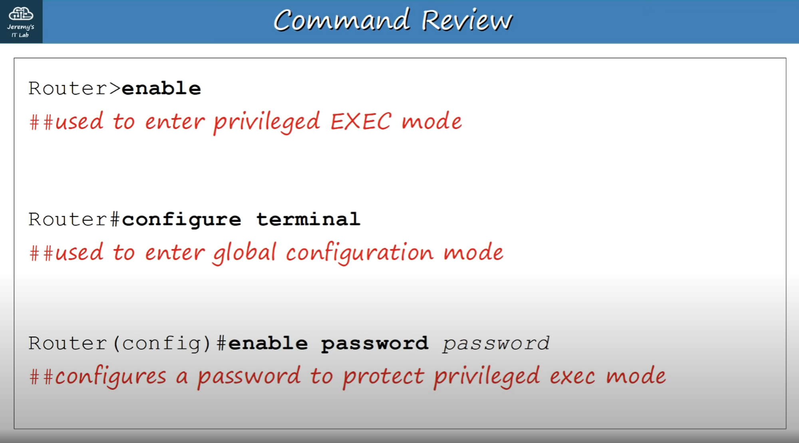

* Ngày 4. INTRO TO THE CLI - Giới thiệu về CLI
## CLI là gì?
- CLI (Command-line Interface) là giao diện dòng lệnh dùng để cấu hình thiết bị Cisco.
- GUI (Graphical User Interface) là giao diện đồ họa (dạng cửa sổ).

## Cách kết nối với thiết bị Cisco
- Console Port: Khi cấu hình lần đầu, bạn phải kết nối qua cổng Console.
- Sử dụng cáp rollover: DB9 serial → RJ45 hoặc DB9 serial → USB (nếu máy tính không có cổng serial).

## Truy cập CLI
- Cần dùng phần mềm giả lập terminal (ví dụ: PuTTY) và kết nối kiểu Serial.
- Thiết lập mặc định của Cisco:
+ Tốc độ: 9600 bps
+ Data bits: 8
+ Stop bits: 1
+ Parity: None
+ Flow Control: None

## Các chế độ CLI
// Khi bạn vừa vào CLI, MẶC ĐỊNH bạn sẽ ở chế độ gọi là ‘User EXEC’.
1. User EXEC Mode
- Khi đăng nhập lần đầu, bạn ở chế độ User EXEC.
- Prompt hiển thị: (Hostname)>
- Chỉ xem thông tin, không được thay đổi cấu hình.
- Gõ 'enable' để chuyển sang Privileged EXEC Mode.
2. Privileged EXEC Mode
- Prompt: (Hostname)#
- Xem cấu hình, khởi động lại thiết bị, lưu cấu hình…
- Không chỉnh cấu hình, nhưng có thể đổi thời gian, lưu file cấu hình.
- Mẹo:
+ Gõ ? để liệt kê lệnh khả dụng.
+ Gõ ? sau vài ký tự để hiện các lệnh bắt đầu bằng chuỗi đó.
+ Nhấn TAB để tự động hoàn tất lệnh.
3. Global Configuration Mode
- Từ Privileged EXEC, gõ: configure terminal hoặc conf t
- Prompt: Router(config)#
- Tại đây bạn có thể gõ run, no, hoặc exit để quay về Privileged EXEC.
- Gõ exit để quay lại ‘Privileged EXEC’ mode.

### Để bật mật khẩu cho User EXEC mode:
Router(config)# enable password (password)
** Passwords phân biệt chữ hoa/thường.
// Lệnh này mã hóa mật khẩu dạng plain-text, hiển thị trong file cấu hình, bằng mã hóa đơn giản.
Router(config)# service password-encryption
- Nếu bạn bật ‘service password-encryption’
- Mật khẩu hiện tại SẼ được mã hóa.
- Mật khẩu trong tương lai SẼ được mã hóa.
- ‘enable secret’ SẼ KHÔNG bị ảnh hưởng.
- Nếu bạn tắt ‘service password-encryption’
- Mật khẩu hiện tại SẼ KHÔNG bị giải mã.
- Mật khẩu trong tương lai SẼ KHÔNG được mã hóa.
- ‘enable secret’ SẼ KHÔNG bị ảnh hưởng.
// Lệnh này bật mật khẩu cho chế độ Privileged EXEC.
Router(config)# enable secret (password)
// enable secret SẼ LUÔN được mã hóa (cấp độ 5)

- Có HAI file cấu hình riêng biệt được giữ trên thiết bị cùng lúc.

+ Running-config :File cấu hình hiện TẠI, ĐANG HOẠT ĐỘNG trên thiết bị. Khi bạn nhập lệnh trong CLI, bạn chỉnh sửa cấu hình đang hoạt động.

+ Startup-config :File cấu hình sẽ được tải khi KHỞI ĐỘNG lại thiết bị.

- Để xem các file cấu hình, trong chế độ ‘Privileged EXEC’:
Router# show running-config   // cho running config //
hoặc
Router# show startup-config   // cho startup config //
- Để LƯU file cấu hình đang chạy, bạn có thể:
Router# write
Building configuration... [OK]

Router# write memory
Building configuration... [OK]

Router# copy running-config startup-config
Destination filename [startup-config]?
Building configuration... [OK]

- Để mã hóa mật khẩu:
Router# conf t
Router(config)# service password-encryption

Điều này làm cho tất cả mật khẩu hiện tại được mã hóa.
Mật khẩu trong tương lai CŨNG sẽ được mã hóa.
“Enable secret” sẽ không bị ảnh hưởng (nó LUÔN được mã hóa).

- Bây giờ bạn sẽ thấy rằng mật khẩu không còn dạng văn bản thuần.

+ “7” ám chỉ loại mã hóa được dùng để mã hóa mật khẩu. Trong trường hợp này, “7” sử dụng mã hóa độc quyền của Cisco.

+ “7” khá dễ bị phá vì mã hóa yếu.

- Để có mã hóa TỐT HƠN / MẠNH HƠN, dùng “enable secret”.

+ “5” ám chỉ mã hóa MD5.
+ Vẫn có thể bị phá nhưng mạnh hơn nhiều.
+ Khi bạn dùng lệnh “enable secret”, lệnh này sẽ ghi đè “enable password”.

- Để HỦY hoặc xóa một lệnh đã nhập, dùng từ khóa “no”

- Trong trường hợp này, vô hiệu hóa “service password-encryption”:

+ mật khẩu hiện tại sẽ KHÔNG bị giải mã (không đổi)

+ mật khẩu trong tương lai sẽ KHÔNG được mã hóa

+ “enable secret” sẽ không bị ảnh hưởng

