* Ngày 7. Địa chỉ IPv4: Phần 1

MÔ HÌNH OSI – TẦNG MẠNG (Layer 3)

- Cung cấp khả năng kết nối giữa các thiết bị cuối ở các mạng khác nhau (ví dụ: ngoài LAN).
- Cung cấp địa chỉ logic (IP address).
- Cung cấp lựa chọn đường đi giữa NGUỒN và ĐÍCH.
- ROUTER hoạt động ở TẦNG 3.

ĐỊNH TUYẾN (ROUTING)

Switch (thiết bị tầng 2) không tách các mạng khác nhau. Chúng chỉ kết nối và mở rộng mạng trong cùng một LAN.

Khi thêm một Router giữa hai Switch, bạn tạo ra sự tách mạng; mỗi phần sẽ có địa chỉ mạng riêng.

Ví dụ:
192.168.1.0/24 (255.255.255.0)
192.168.2.0/24 (255.255.255.0)

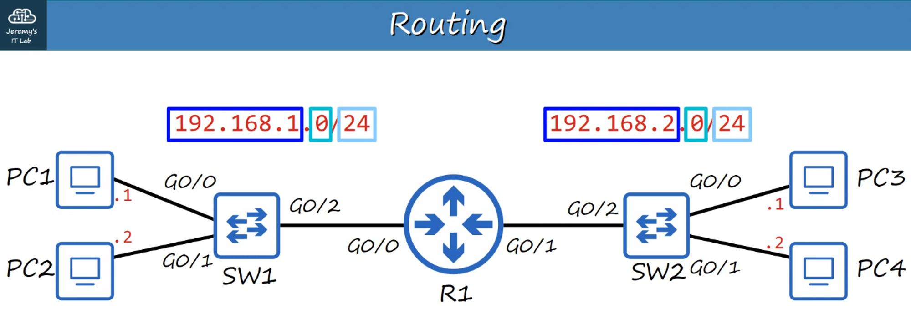


ROUTER có địa chỉ IP duy nhất cho từng giao diện, tùy thuộc vào vị trí kết nối.

Địa chỉ IP cho giao diện G0/0 của Router:
192.168.1.254/24

Địa chỉ IP cho giao diện G0/1 của Router:
192.168.2.254/24

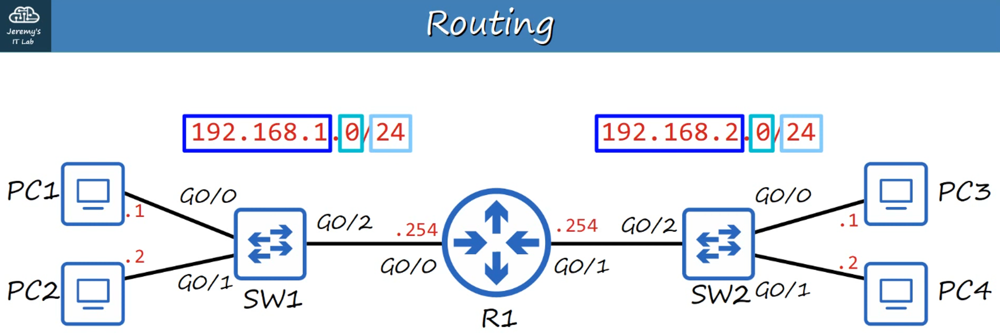


Địa chỉ IP phụ thuộc vào địa chỉ mạng LAN mà nó kết nối.

Phần NETWORK của một IP sẽ giống nhau đối với tất cả host trong cùng một LAN.

Ví dụ:

192.168.1.100
192.168.1.105
192.168.1.205

Tất cả đều thuộc cùng một mạng vì phần NETWORK giống nhau (192.168.1), còn phần HOST (100, 105, 205) là duy nhất.

Khi một gói Broadcast đến Router, nó không đi tiếp. Nó chỉ ở lại trong LAN (Switch/Hosts).

---

IPv4 HEADER

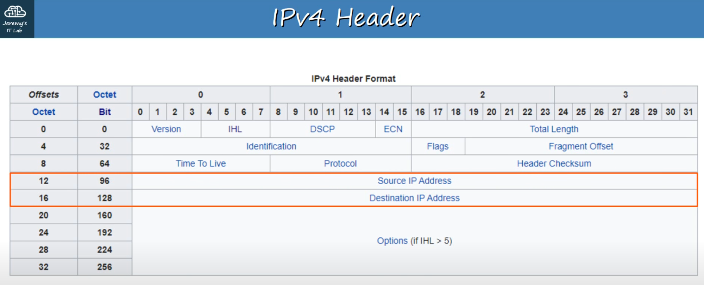


IP (Internet Protocol) là giao thức chính ở Layer 3 hiện nay, và phiên bản 4 (IPv4) là phổ biến nhất.

Header IPv4 chứa nhiều trường hơn so với header Ethernet.

Header IPv4 có trường SOURCE IP và DESTINATION IP.

Trường này dài 32-bit (4 byte) (0-31).

192.168.1.254 (Mỗi số thập phân đại diện cho 8 bit.)

Chuyển sang nhị phân:

11000000 . 10101000 . 00000001 . 11111110

Mỗi nhóm 8 bit được gọi là OCTET.

Do nhị phân khó đọc, chúng ta dùng dấu chấm thập phân (Dotted Decimal) để biểu diễn.

---

Ôn tập DECIMAL và HEXADECIMAL

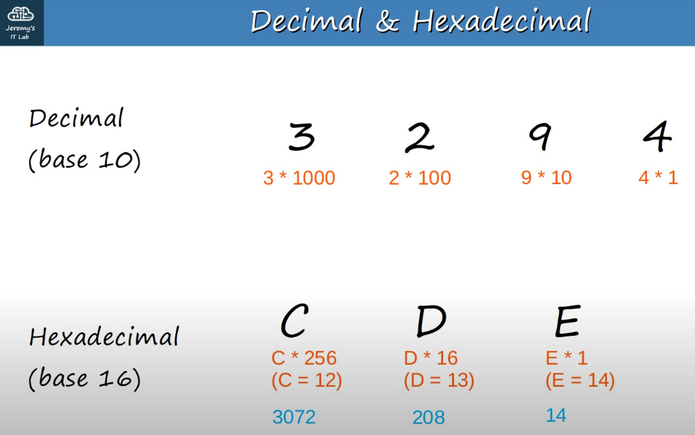


Decimal (base 10)

Ex: 3294 = (3 * 1000) + (2 * 100) + (9 * 10) + (4 * 1)

Hexadecimal (base 16)

Ex: 3294, would be CDE
```
C (C * 256 / 12 * 256 = 3072) // 256ths position
D (D * 16 / D=13 so 16*13 = 208) // 16ths position
E (E * 1 / E = 14)	// 1s position
```
Tổng 3294

---

So, how do we convert a BINARY NUMBER to a DECIMAL NUMBER?
Nhị phân → thập phân:

10001111

So:
```
1 * 128 = 128
1 * 8 = 8
1 * 4 = 4
1 * 2 = 2
1 * 1 = 1
```
Add them all up : 128 + 8 + 4 + 2 + 1 = 143

The answer is 143.

---

Another example:

01110110
```
1 * 64 = 64
1 * 32 = 32
1 * 16 = 16
1 * 4 = 4
1 * 2 = 2
```
Add them all up: 64 + 32 + 16 + 4 + 2 = 118

The answer is 118.

---

Another example:

11101100
```
1 * 128 = 128
1 * 64 = 64
1 * 32 = 32
1 * 8 = 8
1 * 4 = 4
```
Cộng lại: 128 + 64 + 32 + 8 + 4 = 236


---

Thập phân → nhị phân:

Vd: 221.

Lấy các giá trị từ trái sang phải: 128, 64, 32, 16, 8, 4, 2, 1

221
```
221 - 128 = 93 so we place a 1 in the "128" slot
```
10000000
```
93 - 64 = 29 so we place another 1 in the "64" slot

29 - 32 isn't possible so we place a 0 in the "32" slot

29 - 16 = 13 so we place a 1 in the "16" slot

13 - 8 = 5 so we place a 1 in the "8" slot

5 - 4 = 1 so we place a 1 in the "4" slot

1 - 2 isn't possible so we put a 0 in the "2" slot

1 - 1 is possible so we put a 1 in the "1" slot
```
This, then, allows us to the write out the BINARY number for 221.

It is : 11011101

---

Vd khác: 127
```
127 - 128 is not possible so 0 in "128"
127 - 64 is possible so 1 in "64"
63 - 32 is possible so 1 in "32"
31 - 16 is possible so 1 in "16"
15 - 8 is possible so 1 in "8"
7 - 4 is possible so 1 in "4"
3 - 2 is possible so 1 in "2"
1 is possible so 1 in "1"
```
So 127, in BINARY, is 0111 1111

---

Another example: 207

Alternatively, you can subtract the number from '255' (which is 1111111).
The remainder, then, can be used to "find" where the 0's are in the binary number.

255 - 207 = 48 so ...

1 1 0 0 1 1 1 1 (32 + 16 = 48)

11001111 is the correct answer.

---

IPv4 ADDRESSES

IP Address là dấu chấm thập phân của 4 OCTET nhị phân:

192.168.1.254/24

But what does the /24 stand for?

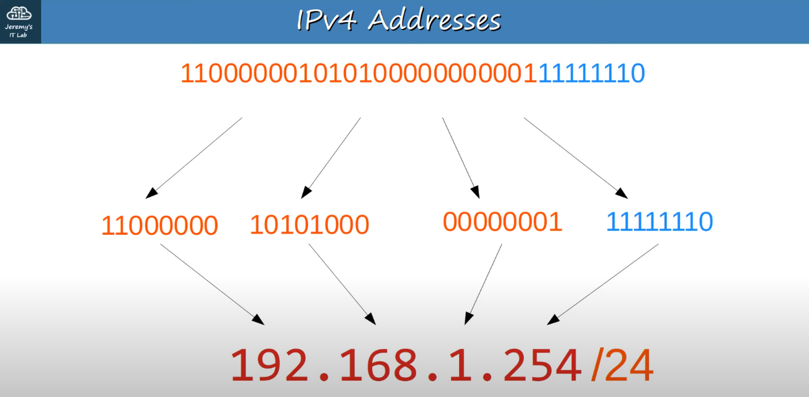


/24 nghĩa là 24 bit đầu tiên là NETWORK PORTION

192.168.1 là NETWORK PORTION (the first 3 OCTETS)

.254 là HOST PORTION (the last OCTET)

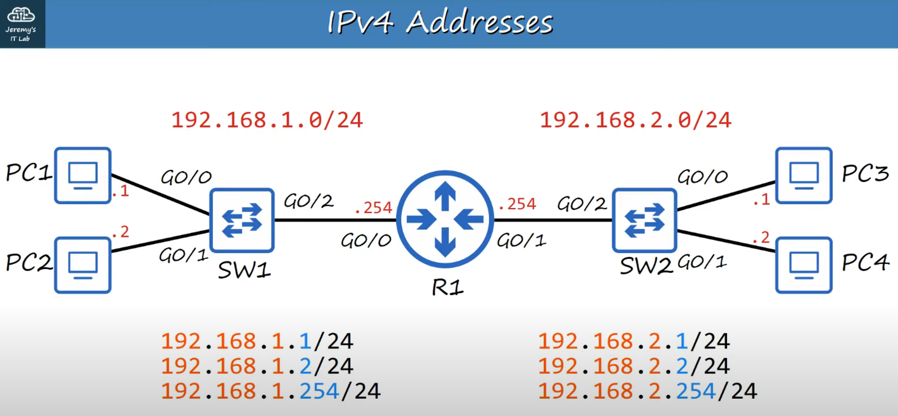


---

Ví dụ chuyển nhị phân → IPv4:

10011010010011100110111100100000

10011010 . 01001110 . 01101111 . 00100000

Octets:

1. 128 + 16 + 8 + 2 = 154
2. 64 + 8 + 4 + 2 = 78
3. 64 + 32 + 8 + 4 + 2 + 1 = 111
4. 32

Đc IpV4 là: 154.78.111.32/16

154.78 là NETWORK PORTION
111.32 là HOST PORTION

Vd khác:

00001100100000001111101100010111

00001100 . 10000000 . 11111011 . 00010111

Octets:

1. 8 + 4 = 12
2. 128
3. 255 - 4 = 251
4. 16 + 4 + 2 + 1 = 23

Đc Ipv4 là: 12.128.251.23/8

12 là NETWORK PORTION
128.251.23 là HOST PORTION

---

IPv4 ADDRESS CLASSES

IPv4 chia thành 5 lớp (A-E), dựa vào OCTET đầu tiên:

| Class | First Octet | Dải số                 |
| ----- | ----------- | ---------------------- |
| A     | 0xxxxxxx    | 0-126 + 127 loopback   |
| B     | 10xxxxxx    | 128-191                |
| C     | 110xxxxx    | 192-223                |
| D     | 1110xxxx    | 224-239 (MULTICAST)    |
| E     | 1111xxxx    | 240-255 (EXPERIMENTAL) |


Nếu OCTET đầu tiên bắt đầu bằng 0, dải số thập phân có thể từ 0–127.

Trong thực hành, chúng ta thường tập trung vào Class A đến Class C.

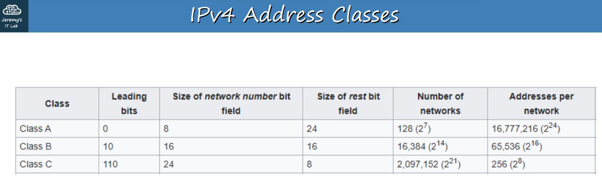


Class D dành cho Multicast Address.

Class E dành cho địa chỉ thử nghiệm (Experimental).

---

Tại sao Class A thường là 1–126?

Vì 127 được dành cho địa chỉ loopback.

Dải địa chỉ 127.0.0.0 → 127.255.255.255 dùng để test mạng.

- Dùng để kiểm tra Network Stack (OSI & TCP/IP model) trên máy cục bộ.

---

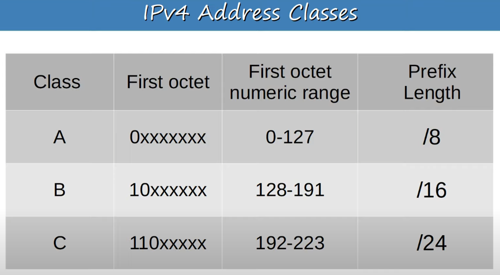


Prefix Length (Độ dài phần mạng): Prefix length là độ dài của NETWORK PORTION của địa chỉ IP.

Ví dụ:

12.128.251.23/8 là CLASS A Address
154.78.111.32/16 là CLASS B Address
192.168.1.254/24 là CLASS C Address

Class A có phần mạng ngắn, tức là có nhiều host khả dụng hơn.

Class C có phần mạng dài, tức là ít host khả dụng hơn.

---

Netmask (Mặt nạ mạng)

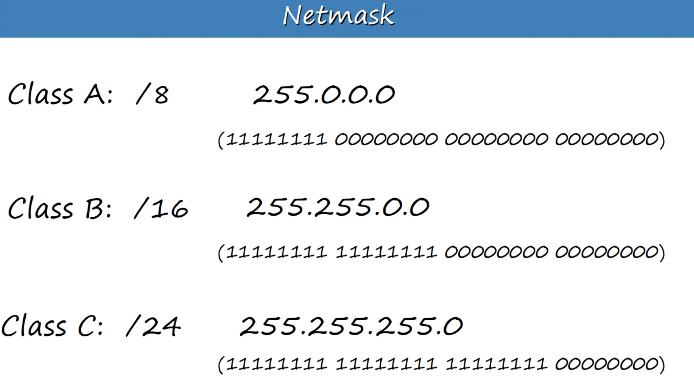


Netmask viết giống IP, theo dấu chấm thập phân:

CLASS A: /8 = 255.0.0.0

CLASS B: / 16 = 255.255.0.0

CLASS C: /24 = 255.255.255.0

---

Network Address (Địa chỉ mạng)

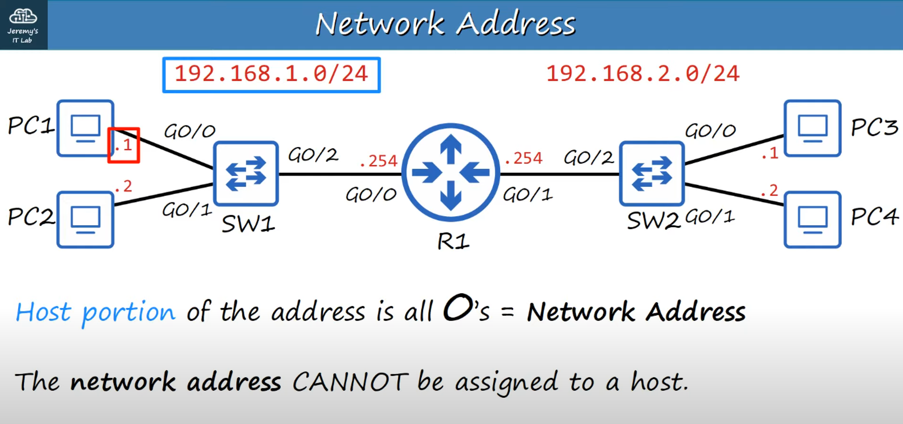


Nếu HOST PORTION toàn 0, đó là Network Address, dùng để xác định mạng.

Vd: 192.168.1.0/24 = địa chỉ mạng.

Network Address không được gán cho host, luôn là địa chỉ đầu tiên của mạng.

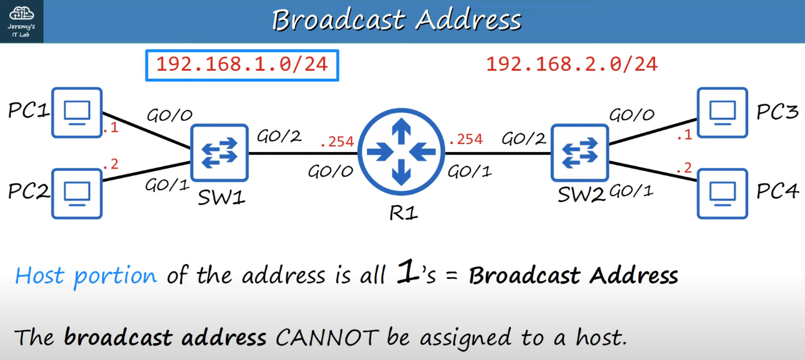


Nếu HOST PORTION toàn 1, đó là Broadcast Address, dùng để gửi tới tất cả host trong mạng.

Địa chỉ Broadcast không thể gán cho một host.
vd: 
DESTINATION IP : 192.168.1.255 (Broadcast IP address)
DESTINATION MAC : FFFF.FFFF.FFFF (Broadcast MAC address)

Do hai địa chỉ này bị giữ lại, nên dải địa chỉ host khả dụng từ 1 → 254 trong mạng 192.168.1.0/24.
