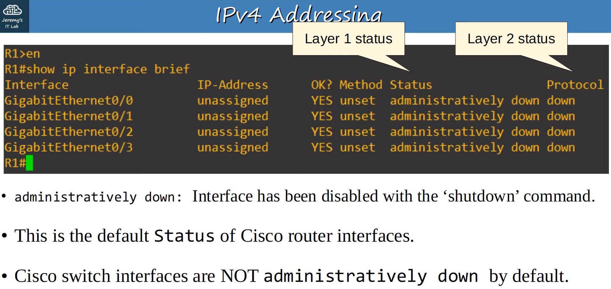
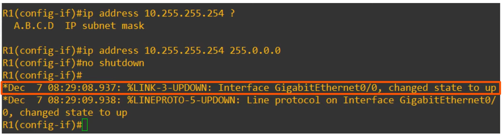
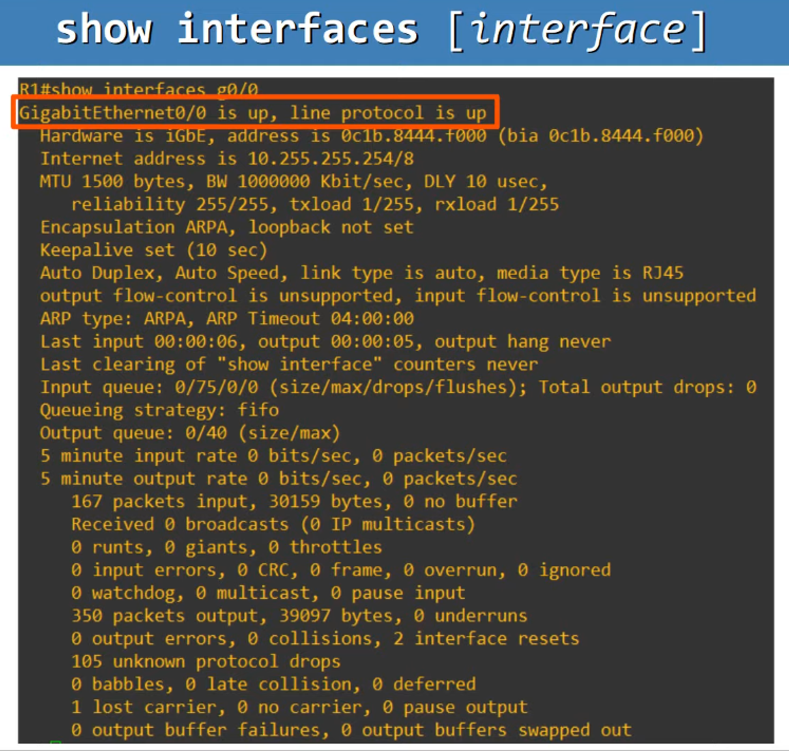

* Ngày 8. IPv4 ADDRESSING : Phần 2

SỐ HOST TỐI ĐA TRONG MỘT MẠNG

Ví dụ Class C:

192.168.1.0/24

(Phạm vi: 0 → 255)

Phần Host (phần “.0”) = 8 bit

Tổ hợp = 8 bits = 2^8 = 256

Tuy nhiên:
- Địa chỉ mạng (Network ID) 192.168.1.0 được dành riêng.

Và

Địa chỉ broadcast 192.168.1.255 cũng được dành riêng

Số host tối đa = 2^8 – 2 = 254 host

---

Ví dụ Class B:

172.16.0.0/16 ----> 172.16.255.255/16

Host portion = 16 bits = 2^16 = 65,536

Số host tối đa = 2^16 – 2 = 65.534 host

---

Ví dụ Class A:

10.0.0.0/8 -------------> 10.255.255.255/8

Host portion = 24 bits = 2^24 = 16,777,216

Số host tối đa = 2^24 – 2 = 16.777.214 host

---

Từ đó:

Công thức tổng quát tính số host:

2 ^ N - 2 (2 to the power of N - 2)

Trong đó N = số bit của phần Host.

---

ĐỊA CHỈ SỬ DỤNG ĐẦU / CUỐI

Class C Network

192.168.1.0/24 (NETWORK ADDRESS)

Thêm 1 vào phần host (00000001)

Địa chỉ sử dụng đầu tiên: 192.168.1.1/24

---

192.168.1.255/24 (BROADCAST ADDRESS)

Trừ 1 (11111110)

Địa chỉ sử dụng cuối cùng: 192.168.1.254/24

---

Class B Network

172.16.0.0/16 (NETWORK ADDRESS)

Thêm 1 vào phần host (0000 0000 0000 0001)

Địa chỉ đầu tiên: 172.16.0.1/16

---

172.16.255.255/16 (BROADCAST ADDRESS)

Subtract 1 to Broadcast Address so 1111 1111 1111 1110

172.16.255.254/16 is the LAST USABLE ADDRESS

---

Class A Network

10.0.0.0/8 (NETWORK ADDRESS)

Thêm 1 (00000000 00000000 00000001)

Địa chỉ đầu tiên: 10.0.0.1/8

---

10.255.255.255/8 (BROADCAST ADDRESS)

Trừ 1 (1111 1111 1111 1110) → 

Địa chỉ cuối cùng: 10.255.255.254/16
---

CẤU HÌNH THIẾT BỊ CISCO TRÊN CLI

R1> enable
R1# show ip interface brief

Liệt kê các giao diện, địa chỉ IP, phương thức, trạng thái và giao thức.

Interfaces (Giao diện):

- Các cổng/giao diện hiện có hoặc đã kết nối?

IP Addresses

- Địa chỉ IP đã được gán.

Method

- Cách gán địa chỉ IP (tĩnh, DHCP, …).

Status (Trạng thái tầng 1)

- Trạng thái vật lý của giao diện.
- “administratively down” = Giao diện bị tắt bằng lệnh shutdown.

Mặc định, giao diện của Router Cisco bị tắt (administratively down).

Switch Cisco mặc định không bị tắt.

Protocol (Trạng thái tầng 2):

- Không thể hoạt động nếu Status (tầng 1) đang down.
  

---

// Vào chế độ cấu hình

R1# conf t

// Chuyển vào chế độ cấu hình terminal.

R1(config)# interface gigabitethernet 0/0

Vào cấu hình giao diện, có thể viết tắt là g0/0.

// Đặt địa chỉ IP và Subnet Mask

R1(config-if) #ip address 10.255.255.254 255.0.0.0

// Kích hoạt giao diện

R1(config-if) #no shutdown

---

Sau lệnh này, sẽ có hai thông báo:

- Trạng thái Status chuyển sang up.

- Giao thức Protocol cũng chuyển sang up.

// Lệnh do cho phép chạy lệnh EXEC đặc quyền ngay trong mode cấu hình.

R1(config-if) #do show ip interface brief

Dùng để xác nhận giao diện đã hoạt động.

---

Dùng để xác nhận giao diện đã hoạt động.

'show interfaces <interface name>'

- Hiển thị thông tin tầng 1, 2 và một phần tầng 3.
- Bao gồm: Địa chỉ MAC (BIA), địa chỉ IP, và nhiều thông tin chi tiết khác.

'show interfaces description'

- Hiển thị mô tả của từng giao diện.

ExamVí dụ:ple:

// Configure mode for interface Gigabyte Interface 0/0

R1(config) #int g0/0

R1(config) #description ## to SW1 ##

This sets the 'Description' column to display:

Interface 				Description

Gi0/0                   ## to SW1 ##
