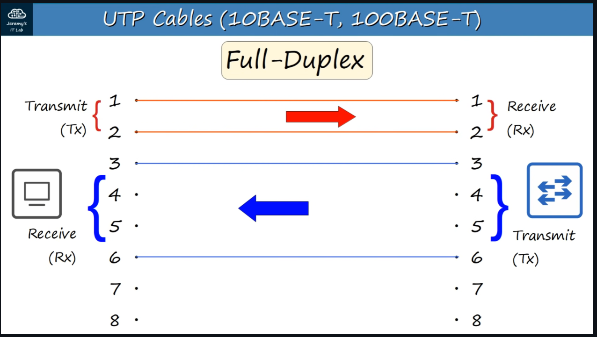
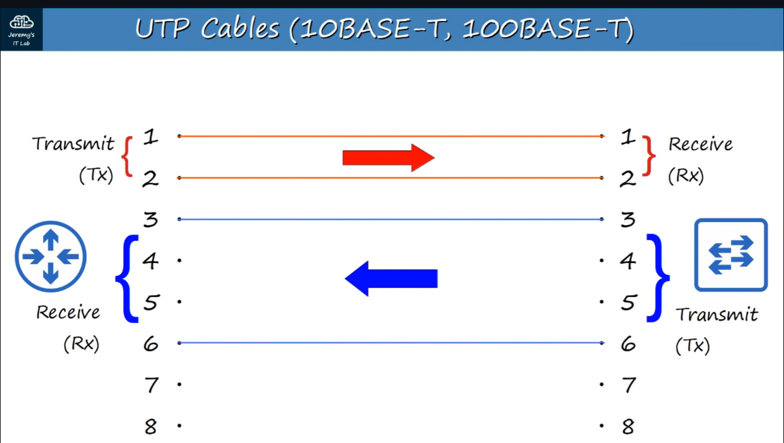
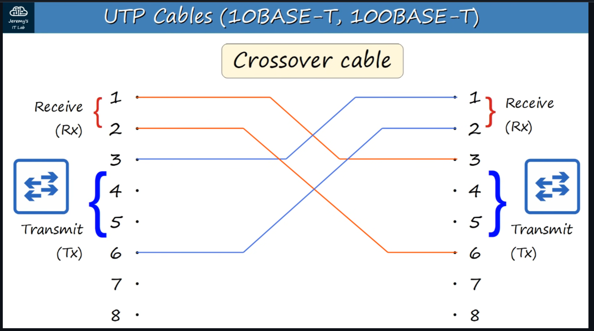
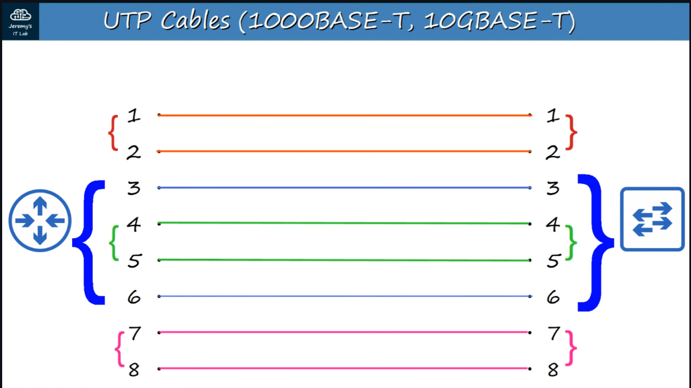
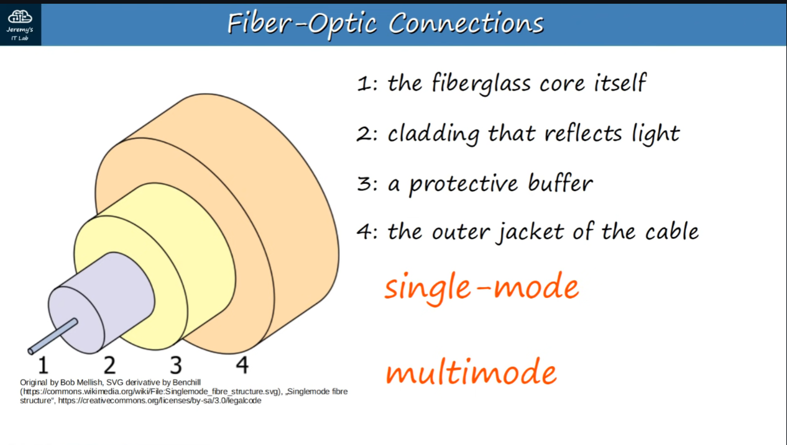
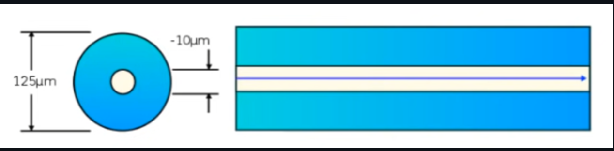
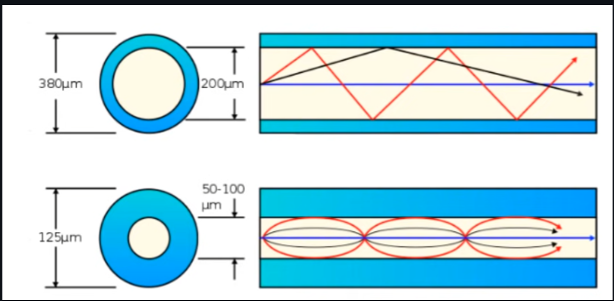
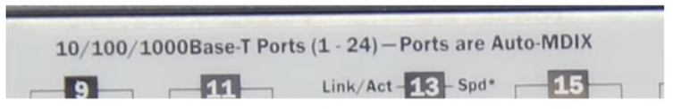

* Ngày 2. Interfaces and Cables - Giao diện và cáp mạng
## SWITCHES và các cổng (Ports)
- Switch cung cấp nhiều cổng để kết nối (thường là 24 cổng), các cổng này thường là cổng RJ-45.

## Ethernet là gì?
- Ethernet là tập hợp các giao thức/ chuẩn mạng.

Vì sao cần giao thức và chuẩn mạng?
- Đảm bảo có chuẩn giao tiếp chung để các thiết bị "nói chuyện" được với nhau.
- Đảm bảo có chuẩn phần cứng chung để các thiết bị kết nối được với nhau.
## Tốc độ kết nối
- Kết nối giữa các thiết bị hoạt động ở một tốc độ nhất định. Đo bằng bit/giây (bps).
1 bit: giá trị "0" hoặc "1".
1 byte bằng 8 bit.

| Đơn vị         | Số bit            |
| -------------- | ----------------- |
| 1 kilobit (Kb) | 1.000             |
| 1 megabit (Mb) | 1.000.000         |
| 1 gigabit (Gb) | 1.000.000.000     |
| 1 terabit (Tb) | 1.000.000.000.000 |

## Chuẩn Ethernet trên dây đồng (Cáp đồng) (IEEE 802.3 - 1983 -- Viện kỹ sư điện và điện tử)
| Tốc độ   | Tên gọi          | Chuẩn   | Loại cáp   | Khoảng cách tối đa |
| -------- | ---------------- | ------- | ---------- | ------------------ |
| 10 Mbps  | Ethernet         | 802.3i  | 10BASE-T   | 100 m              |
| 100 Mbps | Fast Ethernet    | 802.3u  | 100BASE-T  | 100 m              |
| 1 Gbps   | Gigabit Ethernet | 802.3ab | 1000BASE-T | 100 m              |
| 10 Gbps  | 10 Gigabit       | 802.3an | 10GBASE-T  | 100 m              |

Trong đó:
+ BASE = Baseband Signaling (Truyền tín hiệu trên 01 kênh duy nhất).
+ T = Twisted Pair (Cáp xoắn đôi)

- Phần lớn Ethernet dùng cáp đồng xoắn đôi UTP (Unshielded Twisted Pair – không bọc kim loại). Cáp xoắn đôi giúp chống nhiễu điện từ (EMI).
+ 10/100BASE-T dùng 2 cặp dây (4 lõi).
+ 1000BASE-T/10GBASE-T dùng 4 cặp (8 lõi).
- Cat (category) 5e là loại cáp đồng được dùng cho kết nối Ethernet. Nó có hổ trợ tốc độ tối đa lên đến 1Gbps và chiều dài tối đa 100 mét để tránh suy hao tín hiệu. Một số chuẩn cáp phổ biến:

+ Cat 3. 10 Mbps (10BASE-T)

+ Cat 5. 100 Mbps (100BASE-T)

+ Cat 5e. 1 Gbps (1000BASE-T)

+ Cat 6a. 10 Gbps (10GBASE-T)
 
 ## Các thiết bị kết nối như thế nào qua kết nối của chúng?
 - Mỗi cáp Ethernet có đầu cắm RJ-45 với 8 chân ở 2 đầu.
+ PC truyền (TX) trên chân 1–2, nhận (RX) trên chân 3–6.
+ Switch ngược lại: nhận 1–2, truyền 3–6.
+ Cho phép truyền song công (Full-Duplex).
- Kết nối khác loại Router – Switch, Switch - PC
+ Router truyền 1–2, nhận 3–6 (giống PC).
+ Cáp dùng: Straight-Through (thẳng).

- Kết nối cùng loại thiết bị (PC–PC, Switch–Switch…):
+ Dùng Crossover cable (chéo) – hoán đổi 1↔3, 2↔6.

| Thiết bị | Chân truyền | Chân nhận |
| -------- | ----------- | --------- |
| Router   | 1,2         | 3,6       |
| Firewall | 1,2         | 3,6       |
| PC       | 1,2         | 3,6       |
| Switch   | 3,6         | 1,2       |

- Thiết bị hiện đại hỗ trợ Auto MDI-X: tự nhận dạng và hoán đổi chân.
- 1000BASE-T / 10GBASE-T = 4 cặp dây (8 lõi).
- Mỗi cặp dây hoạt động hai chiều (bidirectional), nên có thể truyền và nhận đồng thời.
- Nhờ đó tốc độ cao hơn hẳn so với chuẩn 10/100BASE-T (vốn chỉ dùng 2 cặp dây một chiều).

## KẾT NỐI CÁP QUANG (FIBER-OPTIC)
- Chuẩn: IEEE 802.3ae. 
- Dùng module SFP (Small Form-Factor Pluggable) - module cắm nhỏ cho phép cáp quang kết nối với switch/router. 
- Cáp quang thường có 02 sợi riêng: 01 sợi truyền (Transmit) và 01 sợi nhận (Receice).
- Một sợi cáp quang gồm 04 lớp chính (lõi -> lớp phản xạ -> Lớp bảo vệ -> Lớp vỏ ngoài)

- Có 2 loại:
+ Single-Mode (đơn mode): 
++ Lõi hẹp hơn Mutimode.
++ Tia sáng đi vào theo một góc duy nhất (một “mode”), sử dụng laser để truyền.
++ Cho phép chiều dài cáp xa nhất, vượt cả cáp đồng (UTP) và cáp quang multimode.
++ Đắt hơn multimode vì cần bộ phát laser SFP giá cao.

+ Multimode (đa mode): 
++ Lõi rộng hơn so với single-mode.
++ Cho phép nhiều góc (nhiều “mode”) của tia sáng đi vào lõi.
++ Khoảng cách truyền xa hơn UTP nhưng ngắn hơn single-mode.
++ Rẻ hơn single-mode vì dùng bộ phát LED SFP giá thấp.

- Chuẩn tốc độ cáp quang. 

| Tốc độ      | Chuẩn   | Khoảng cách tối đa            |
| ----------- | ------- | ----------------------------- |
| 1000BASE-LX | 1 Gbps  | 550 m (Multi) / 5 km (Single) |
| 10GBASE-SR  | 10 Gbps | 400 m (Multi)                 |
| 10GBASE-LR  | 10 Gbps | 10 km (Single)                |
| 10GBASE-ER  | 10 Gbps | 30 km (Single)                |

## So sánh cáp UTP và cáp quang (Fiber-Optic)

- UTP (cáp đồng xoắn đôi):
+ Chi phí thấp hơn so với cáp quang.
+ Khoảng cách tối đa ngắn hơn (khoảng ~100 m).
+ Dễ bị nhiễu điện từ (EMI).
+ Cổng RJ45 dùng cho UTP rẻ hơn so với cổng SFP.
+ Có thể rò rỉ tín hiệu yếu ra ngoài, kẻ xấu có thể khai thác (rủi ro bảo mật).
- Cáp quang (Fiber-Optic):
+ Chi phí cao hơn UTP.
+ Khoảng cách truyền dài hơn UTP.
+ Không bị nhiễu điện từ (EMI).
+ Cổng SFP đắt hơn cổng RJ45 (trong đó single-mode đắt hơn multimode).
+ Không rò rỉ tín hiệu ra ngoài (an toàn hơn).

### Câu hỏi
Q1. Bạn kết nối 02 Router cũ với bằng cáp UTP, tuy nhiên dữ liệu không được gửi và nhận thành công giữa chúng. Vấn đề có thể là gì?
a. Chúng được kết nối bằng cáp thẳng -> CA
b. Chúng được kết nối bằng cáp chéo.
c. Chúng đang hoạt động ở chế độ auto MDI-X.

Q2. Công ty của bạn muốn kết nối các Switch trong 02 tòa nhà riêng biệt cách nhau khoảng 150 mét. Họ muốn giảm chi phí nếu có thể. Vậy họ nên sử dụng loại cáp nào?
a. UTP - Không hổ trợ khoảng cách trên 100 mét
b. Single-Mode fiber - Đắt
c. Multimode fiber -> CA

Q3. Công ty của bạn muốn kết nối 02 văn phòng cách nhau khoảng 3 km. Họ muốn giảm chi phí nếu có thể. Vậy họ nên sử dụng loại cáp nào?
a. UTP
b. Single-Mode fiber -> CA
c. Multimode fiber 

Q4. Một công tắc có chỉ báo sau trên giao diện mạng của nó:

Điều gì sẽ xảy ra nếu bạn kết nối nó với một công tắc giống hệt bằng cáp thẳng?
a. Chúng sẽ hoạt động bình thường. -> CA vì có MDI-X (dù kết nối bằng cáp chéo)
b. Chúng sẽ hoạt động ở tốc độ chậm hơn. - Không thể chậm hơn ngay cả khi không có MDI-X
c. Chúng sẽ không giao tiếp được.

Q5. Công ty của bạn cần kết nối nhiều end host với Switch được đặt trong tủ đấu dây ở cùng tầng văn phòng với các máy chủ. Họ nên sử dụng loại cáp nào?
a. UTP -> CA, hầu hết các end host không có khả năng kết nối với Switch thông qua cáp quang và Switch không có đủ giao diện SFP để hỗ trợ nhiều máy chủ. UTP là tiêu chuẩn, end host có 1 cổng RJ45 trên card giao diện mạng để kết nối cáp UTP 
b. Single-Mode fiber 
c. Multimode fiber 