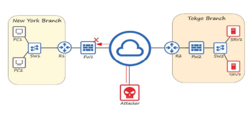

*Ngày 1. Networking Devices - Thiết bị mạng

## Mạng là gì?
- Mạng máy tính là 01 mạng viễn thông số cho phép các nút (nodes) chia sẻ tài nguyên.
- Client (máy khách): là thiết bị truy cập dịch vụ do Server cung cấp.
- Server là thiết bị cung cấp chức năng/dịch vụ cho các client.

## Switch (Thiết bị chuyển mạch - Tầng 2)
- Cung cấp kết nối cho các máy chủ và máy trạm trong cùng 01 mạng LAN (nội bộ).
- Có nhiều cổng mạng để các *end hosts* (máy tính, máy in, camera,..) kết nối
*Không thể kết nối mạng LAN khác nhau hay ra Internet*
-> Giống như 01 "ổ cắm điện có nhiều ngõ ra" chỉ giúp các thiết bị trong cùng 01 văn phòng/nhà chia sẻ dữ liệu với nhau.

## Router (Bộ định tuyến - Tầng 3)
- Thường có ít cổng mạng hơn Switch.
- Dùng để kết nối giữa nhiều LAN khác nhau.
- Cho phép dữ liệu truyền ra Internet
-> Giống như "người đưa thư quốc tế" gửi tin ra ngoài mạng khác.
## FIREWALL (Tường lửa - tâng 3, 4, 7)
- Là thiết bị phần cứng chuyên dụng về bảo mật mạng, kiểm soát lưu lượng đi vào/ra khỏi hệ thống mang.
- Có thể đặt bên trong hoặc bên ngoài mạng.
- Giám sát và kiểm soát lưu lượng dựa trên các qui tắc cấu hình.
- Khi được tích hợp khả năng lọc nâng cao, hiện đại thì gọi là Next-Generation FireWall (NGFW).
- Ngoài ra, còn có host-based FireWall là phần mềm cài trực tiếp trên máy tính để lọc lưu lượng chính máy đó.

