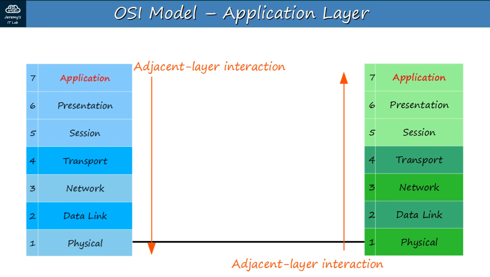
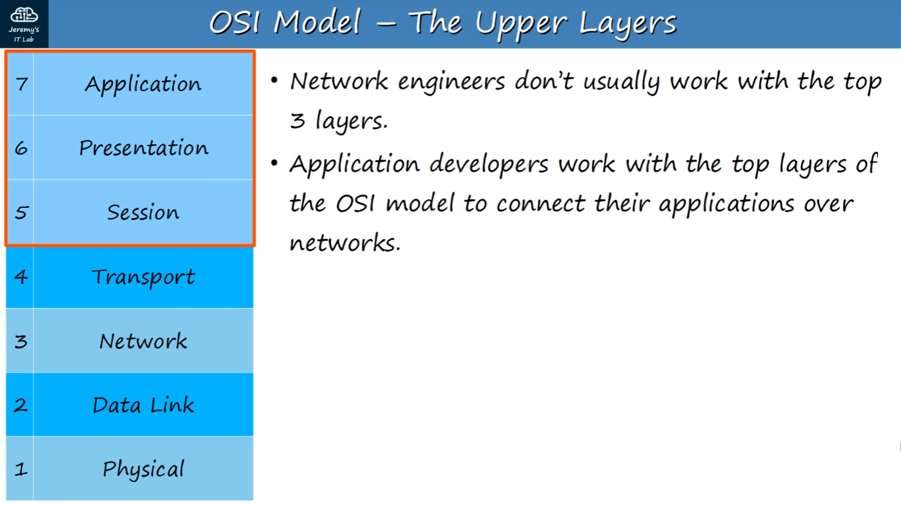
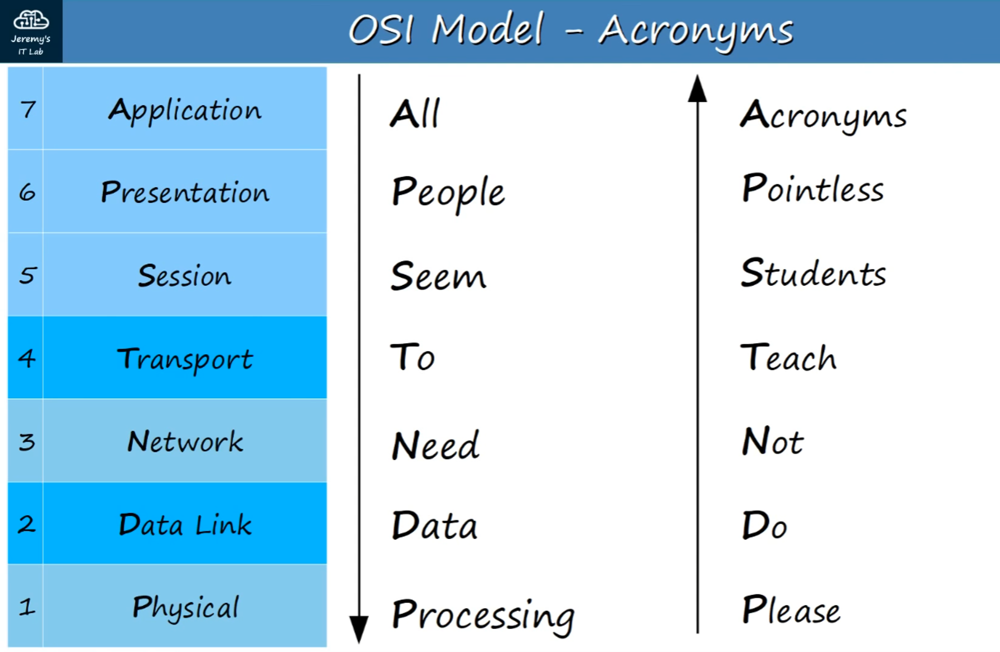
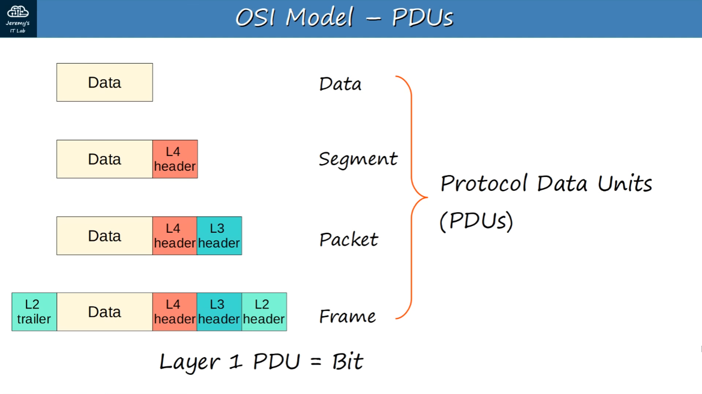
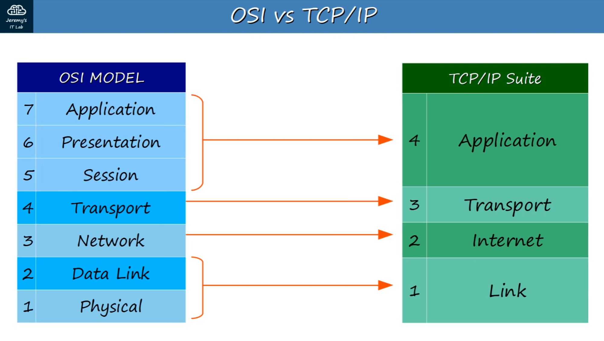
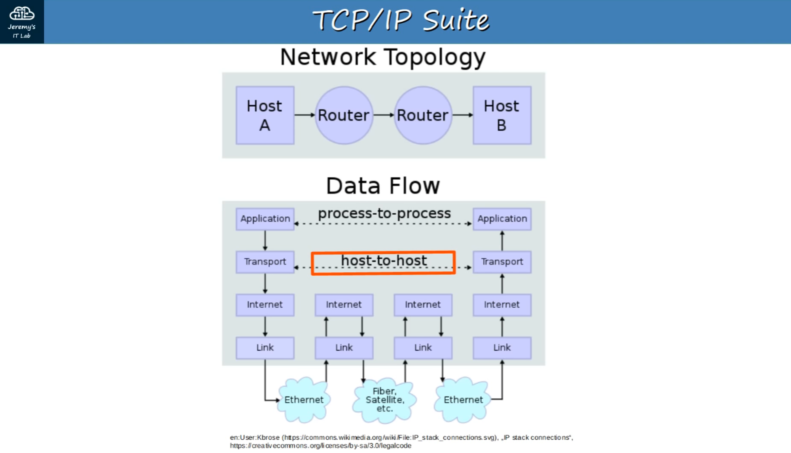

* Ngày 3. MÔ HÌNH OSI & BỘ GIAO THỨC TCP/IP
## Networking model (Mô hình mạng) là gì?
- Mô hình mạng phân loại và cung cấp cấu trúc cho các giao thức và tiêu chuẩn mạng.
- Protocol (giao thức): tập hợp các quy tắc logic quy định cách thiết bị mạng và phần mềm hoạt động.
## Mô hình OSI (Open Systems Interconnection Model)
- Là mô hình khái niệm dùng để phân loại và tiêu chuẩn hóa các chức năng trong mạng.
- Được tạo bởi Tổ chức Tiêu chuẩn hóa Quốc tế (ISO).
- Chia thành 7 tầng (Layers).
- Các tầng này phối hợp với nhau để mạng hoạt động.

### Quá trình truyền dữ liệu:
- Khi dữ liệu đi từ tầng cao xuống tầng thấp, quá trình gọi là “encapsulation” (đóng gói).
- Khi dữ liệu đi từ tầng thấp lên tầng cao, quá trình gọi là “de-encapsulation” (gỡ đóng gói).
- Khi hai thiết bị tương tác ở cùng một tầng, gọi là “same-layer interaction” (tương tác cùng tầng).

### Mẹo ghi nhớ thứ tự 7 tầng (Mnemonic):
 - Application, Presentation, Session, Transport, Network, Data Link, Physical -> “All People Seem To Need Data Processing” -> "Ứng – Trình – Phiên – Vận – Mạng – Liên – Vật".

### The layers are :
7 – APPLICATION (Ứng dụng)

Tầng gần người dùng nhất, tương tác trực tiếp với phần mềm ứng dụng.

Ví dụ giao thức: HTTP, HTTPS.

Chức năng:

Xác định đối tác liên lạc (communication partners).

Đồng bộ giao tiếp (synchronizing communication).

6 – PRESENTATION (Trình bày)

Chuyển đổi định dạng dữ liệu giữa ứng dụng và định dạng mạng để truyền đi.

Đảm bảo dữ liệu được mã hóa/giải mã, nén/giải nén khi cần.

5 – SESSION (Phiên)

Kiểm soát các phiên liên lạc (session) giữa các thiết bị/ứng dụng.

Thiết lập, quản lý, kết thúc kết nối giữa ứng dụng cục bộ và ứng dụng từ xa.

Kỹ sư mạng hiếm khi làm việc trực tiếp với 3 tầng trên cùng; các lập trình viên ứng dụng mới cần quan tâm.

4 – TRANSPORT (Vận chuyển)

Phân mảnh (segment) và tái lắp dữ liệu để giao tiếp giữa các thiết bị đầu cuối.

Chia dữ liệu lớn thành các đoạn nhỏ dễ truyền và giảm lỗi.

Cung cấp giao tiếp Host-to-Host (end-to-end).

Khi dữ liệu từ tầng 7–5 xuống tầng 4, nó được thêm Header của tầng 4 →
<< DATA + L4 Header >> gọi là SEGMENT.

3 – NETWORK (Mạng)

Kết nối các thiết bị ở các mạng khác nhau (ra ngoài LAN).

Cung cấp địa chỉ logic (IP).

Chọn đường đi (routing) từ nguồn đến đích.

Router hoạt động ở tầng 3.

Khi dữ liệu + L4 Header đến đây, thêm Header tầng 3 →
<< DATA + L4 Header + L3 Header >> gọi là PACKET.

2 – DATA LINK (Liên kết dữ liệu)

Kết nối nút–tới–nút (PC–Switch, Switch–Router, Router–Router).

Định dạng dữ liệu để truyền trên môi trường vật lý (như cáp đồng UTP).

Phát hiện và có thể sửa lỗi vật lý (tầng 1).

Sử dụng địa chỉ tầng 2 (MAC), khác với địa chỉ IP tầng 3.

Switch hoạt động ở tầng 2.

Khi Packet đến đây, thêm Header và Trailer tầng 2 →
<< L2 Trailer + DATA + L4 Header + L3 Header + L2 Header >> gọi là FRAME.

1 – PHYSICAL (Vật lý)

Xác định đặc tính vật lý của phương tiện truyền (điện áp, khoảng cách tối đa, đầu nối, loại cáp).

Chuyển đổi bit số thành tín hiệu điện (có dây) hoặc tín hiệu vô tuyến (không dây).

Mọi thông tin về thiết bị mạng (như trong phần trước) đều liên quan tới tầng Vật lý.

## OSI MODEL - PDU's

- PDU là Đơn vị dữ liệu giao thức.
- Mỗi bước trong quá trình truyền dữ liệu tương ứng với một loại PDU:

| **Tầng OSI** | **Tên PDU**        | **Dữ liệu được thêm**             |
| ------------ | ------------------ | --------------------------------- |
| **7 – 5**    | **DATA (Dữ liệu)** | Dữ liệu gốc từ ứng dụng           |
| **4**        | **SEGMENT (Đoạn)** | Thêm **Header tầng 4**            |
| **3**        | **PACKET (Gói)**   | Thêm **Header tầng 3**            |
| **2**        | **FRAME (Khung)**  | Thêm **Header và Trailer tầng 2** |
| **1**        | **BIT (Bit)**      | Truyền tín hiệu 0 và 1            |

Ví dụ đóng gói: << L2 Trailer + DATA + L4 Header + L3 Header + L2 Header >>
- Dữ liệu đi xuống các tầng, mỗi tầng thêm thông tin điều khiển riêng (header/trailer).

## TCP/IP Suite
- Là mô hình khái niệm và bộ giao thức truyền thông được dùng trên Internet và nhiều mạng khác.
- Gọi là TCP/IP vì TCP (Transmission Control Protocol) và IP (Internet Protocol) là hai giao thức nền tảng.
- Phát triển bởi Bộ Quốc phòng Hoa Kỳ (US DoD) thông qua DARPA (Defense Advanced Research Projects Agency).
- Cấu trúc tương tự OSI nhưng ít tầng hơn.
- Đây mới là mô hình thực tế được sử dụng trong các mạng hiện đại.
- Lưu ý: Mặc dù TCP/IP là tiêu chuẩn dùng thật, mô hình OSI vẫn được các kỹ sư mạng sử dụng để tư duy và mô tả các khái niệm mạng.

## Tương tác giữa các tầng (Layer Interactions)

1. Adjacent-Layer Interactions
- Là tương tác giữa các tầng khác nhau trong cùng một thiết bị (host).
Ví dụ:
- Tầng 5–7 (Application / Presentation / Session) gửi Data xuống Tầng 4.
- Tầng 4 thêm Header của Layer 4, tạo thành SEGMENT.
2. Same-Layer Interactions
- Là tương tác giữa cùng một tầng nhưng ở các thiết bị khác nhau.
- Khái niệm này cho phép bạn bỏ qua các tầng khác, chỉ tập trung vào việc hai thiết bị giao tiếp tại cùng một tầng.
Ví dụ:
- Tầng Ứng dụng (Application Layer) của máy chủ web YouTube giao tiếp trực tiếp với trình duyệt trên PC của bạn (cũng ở tầng Ứng dụng).
Tóm gọn:
- Adjacent-Layer = giao tiếp giữa các tầng kề nhau trong một thiết bị.
- Same-Layer = giao tiếp cùng tầng nhưng khác thiết bị.

### Câu hỏi.
Q1. Dữ liệu HTTP được gửi từ máy chủ web Youtube sẽ được hiển thị qua trình duyệt web của bạn. Đây là ví dụ về cái gì?
a. Tương tác liền kề.
b. Tương tác cùng lớp -> CA, Máy chủ HTTp của Youtube và trình duyệt web ở cùng lớp 7.
c. Đóng gói
d. Mở gói  

Q2. Dữ liệu HTTP đã được đóng gói với ba tiêu đề riêng biệt và một phần cuối.Tên gọi phù hợp cho PDU này là gì?
a. Packet
b. Segment
c. Frame -> CA
d. Data

Q3. Những lớp nào của mô hình OSI có liên quan nhất đến vai trò của kỹ sư mạng?
a. Vận chuyển - Mạng - Dữ liệu - Vật lí -> CA
b. Vận chuyển - Mạng - Dữ liệu
c. Chỉ Mạng
d. Ứng dụng - Trình bày - Phiên

Q4. Tầng liên kết của mô hình TCP/IP tương đương với tầng nào trong mô hình OSI
a. Vận chuyển và mạng
b. Mạng và dữ liệu
c. Dữ liệu
d. Dữ liệu và vật lí -> CA, 

Q5. Tầng nào trong mô hình OSI cung cấp khả năng giao tiếp giữa máy chủ và máy chủ?
a. Ứng dụng - giữa các tiến trình
b. Mạng
c. Vận chuyển -> CA,  
d. Dữ liệu